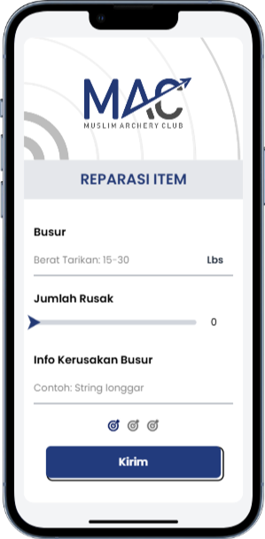
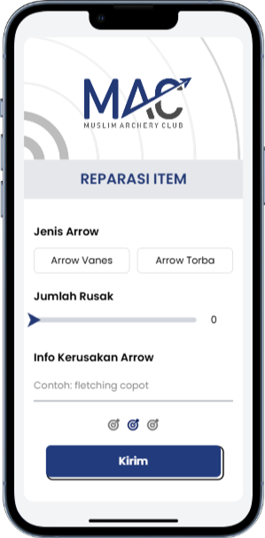
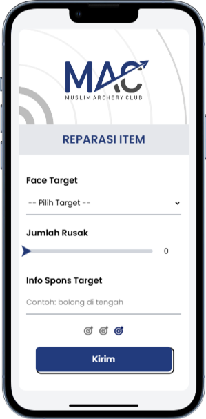

# MAC Reporting System 🏹

A reporting system for the **Muslim Archery Club (MAC)** to easily track damaged bows, arrows, and face targets.  
This project combines **Google Forms** + **Google Sheets** via **Apps Script**, making reporting fast, organized, and always accessible.  

---

## Features ✨

- User-friendly form to report damaged equipment  
- Data automatically recorded in Google Sheets  
- Keeps records neat and easy to access   
- Reduces paperwork and manual tracking  

---

## How It Works ⚡

1. Members fill out the **report form** for damaged equipment.  
2. Data is automatically recorded in Google Sheets.  
3. Admins can **view, sort, and track** reports in real-time.  

---

## Demo / Screenshot 📸

**Bow Report:**  
  

**Arrow Report:**  
  

**Face Target Report:**  
  

---

## Tech Stack 🛠

- **Google Forms** – easy input for users  
- **Google Sheets** – organized data storage  
- **Apps Script** – automation between form & sheet  

---

## Why This Project? 💡

Perfect for clubs or small organizations that want to **keep equipment in check** without hassle.  
Simple setup, maximum efficiency.  
